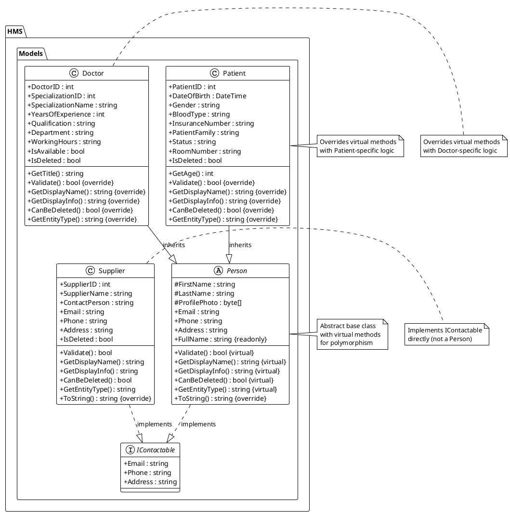
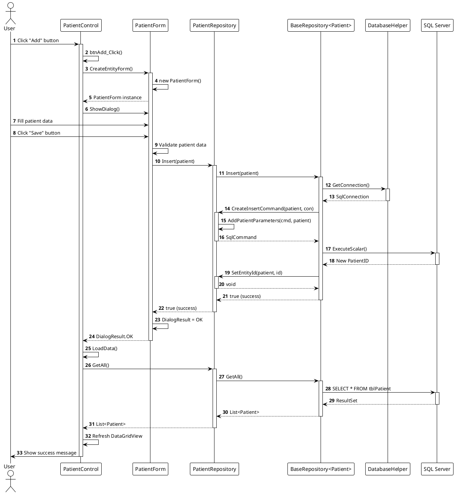
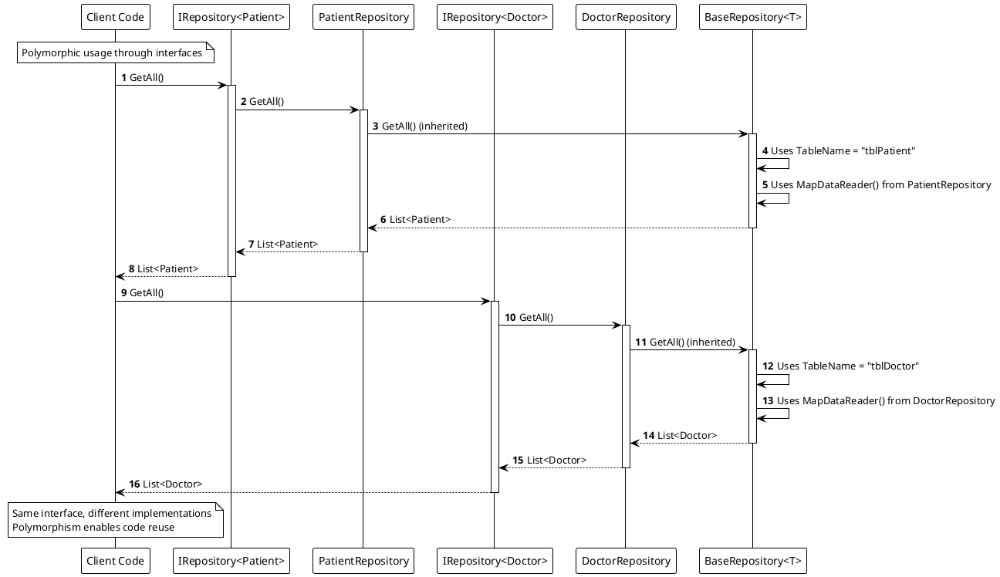

# Object-Oriented Programming (OOP) Implementation

This document describes all Object-Oriented Programming principles and design patterns implemented in the Hospital Management System (HMS) project.

---

## 📋 Table of Contents

- [OOP Principles](#oop-principles)
  - [1. Encapsulation](#1-encapsulation)
  - [2. Inheritance](#2-inheritance)
  - [3. Polymorphism](#3-polymorphism)
  - [4. Abstraction](#4-abstraction)
- [Design Patterns](#design-patterns)
  - [1. Repository Pattern](#1-repository-pattern)
  - [2. Template Method Pattern](#2-template-method-pattern)
  - [3. Interface Segregation](#3-interface-segregation)
- [Class Hierarchy](#class-hierarchy)
- [Code Examples](#code-examples)
- [Benefits of OOP Implementation](#benefits-of-oop-implementation)

---

## 🎯 OOP Principles

### 1. Encapsulation

**Definition**: Encapsulation is the bundling of data and methods that operate on that data within a single unit (class), hiding internal implementation details from the outside world.

#### Implementation Examples:

**Model Classes** (`HMS/Models/`)
- Properties are encapsulated with `get` and `set` accessors
- Private fields protect internal state
- Validation logic is encapsulated within the class

```csharp
// Person.cs
public abstract class Person : IContactable
{
    private string _firstName;
    public string FirstName 
    { 
        get { return _firstName; } 
        set { _firstName = value ?? string.Empty; } 
    }
    
    // Computed property - encapsulation of logic
    public string FullName => $"{FirstName} {LastName}".Trim();
}
```

**Repository Classes** (`HMS/Repositories/`)
- Database connection logic is encapsulated
- SQL command creation is private/protected
- Data mapping logic is hidden from consumers

```csharp
// BaseRepository.cs
public abstract class BaseRepository<T> : IRepository<T>
{
    protected abstract string TableName { get; }
    protected abstract SqlCommand CreateInsertCommand(T entity, SqlConnection con);
    
    // Public interface, private implementation
    public virtual bool Insert(T entity)
    {
        using (SqlConnection con = DatabaseHelper.GetConnection())
        {
            con.Open();
            SqlCommand cmd = CreateInsertCommand(entity, con);
            // Implementation details hidden
        }
    }
}
```

**Static Utility Classes**
- `ImageHelper`: Encapsulates image conversion logic
- `UITheme`: Encapsulates UI styling constants and methods
- `DatabaseHelper`: Encapsulates database connection management

---

### 2. Inheritance

**Definition**: Inheritance allows a class to inherit properties and methods from a parent class, promoting code reuse and establishing an "is-a" relationship.

#### Implementation Examples:

**Person Class Hierarchy**

```
Person (Abstract Base Class)
    ├── Patient (Concrete Class)
    └── Doctor (Concrete Class)
```

**File**: `HMS/Models/Person.cs`
```csharp
public abstract class Person : IContactable
{
    public string FirstName { get; set; }
    public string LastName { get; set; }
    public byte[] ProfilePhoto { get; set; }
    public string Email { get; set; }
    public string Phone { get; set; }
    public string Address { get; set; }
    
    public virtual bool Validate() { /* Base implementation */ }
    public virtual string GetDisplayName() { /* Base implementation */ }
}
```

**File**: `HMS/Models/Patient.cs`
```csharp
public class Patient : Person
{
    // Patient-specific properties
    public int PatientID { get; set; }
    public DateTime DateOfBirth { get; set; }
    public string Gender { get; set; }
    
    // Override base class methods
    public override bool Validate()
    {
        return base.Validate() && 
               !string.IsNullOrWhiteSpace(Gender);
    }
    
    public override string GetDisplayName()
    {
        return $"{FullName} (Patient)";
    }
}
```

**File**: `HMS/Models/Doctor.cs`
```csharp
public class Doctor : Person
{
    // Doctor-specific properties
    public int DoctorID { get; set; }
    public int SpecializationID { get; set; }
    public string SpecializationName { get; set; }
    
    // Override base class methods
    public override bool Validate()
    {
        return base.Validate() && 
               SpecializationID > 0;
    }
    
    public override string GetDisplayName()
    {
        return $"{FullName}, {SpecializationName}";
    }
}
```

**Repository Class Hierarchy**

```
IRepository<T> (Interface)
    └── BaseRepository<T> (Abstract Base Class)
            ├── PatientRepository (Concrete Class)
            ├── DoctorRepository (Concrete Class)
            └── SupplierRepository (Concrete Class)
```

**File**: `HMS/Repositories/BaseRepository.cs`
```csharp
public abstract class BaseRepository<T> : IRepository<T> where T : class
{
    protected abstract string TableName { get; }
    protected abstract string PrimaryKey { get; }
    
    // Common implementation
    public virtual List<T> GetAll()
    {
        // Shared logic for all repositories
    }
    
    // Abstract methods - must be implemented by derived classes
    protected abstract T MapDataReader(SqlDataReader reader);
    protected abstract SqlCommand CreateInsertCommand(T entity, SqlConnection con);
}
```

**File**: `HMS/Repositories/PatientRepository.cs`
```csharp
public class PatientRepository : BaseRepository<Patient>
{
    protected override string TableName => "tblPatient";
    protected override string PrimaryKey => "PatientID";
    
    // Implementation of abstract methods
    protected override Patient MapDataReader(SqlDataReader reader)
    {
        return new Patient { /* Mapping logic */ };
    }
    
    protected override SqlCommand CreateInsertCommand(Patient entity, SqlConnection con)
    {
        // Patient-specific insert logic
    }
}
```

**Control Class Hierarchy**

```
UserControl (WinForms Base)
    └── BaseEntityControl<T, TRepository> (Abstract Base Class)
            └── (Used by entity controls for common UI functionality)
```

---

### 3. Polymorphism

**Definition**: Polymorphism allows objects of different types to be treated as instances of a common base type, enabling flexible and extensible code.

#### Implementation Examples:

**Interface Polymorphism**

**File**: `HMS/Repositories/IRepository.cs`
```csharp
public interface IRepository<T> where T : class
{
    List<T> GetAll();
    T GetById(int id);
    bool Insert(T entity);
    bool Update(T entity);
    bool Delete(int id);
    List<T> Search(string searchTerm);
}
```

Multiple implementations:
- `PatientRepository : IRepository<Patient>`
- `DoctorRepository : IRepository<Doctor>`
- `SupplierRepository : IRepository<Supplier>`

**Runtime Polymorphism with Virtual Methods**

**File**: `HMS/Models/Person.cs`
```csharp
public abstract class Person : IContactable
{
    // Virtual method - can be overridden
    public virtual bool Validate()
    {
        return !string.IsNullOrWhiteSpace(FirstName) &&
               !string.IsNullOrWhiteSpace(LastName);
    }
    
    public virtual string GetDisplayName()
    {
        return FullName;
    }
    
    public virtual bool CanBeDeleted()
    {
        return true;
    }
}
```

**File**: `HMS/Models/Patient.cs`
```csharp
public class Patient : Person
{
    // Override with Patient-specific logic
    public override bool Validate()
    {
        return base.Validate() && 
               !string.IsNullOrWhiteSpace(Gender) &&
               !string.IsNullOrWhiteSpace(BloodType);
    }
    
    public override string GetDisplayName()
    {
        return $"{FullName} (Patient)";
    }
    
    public override bool CanBeDeleted()
    {
        return Status != "Active"; // Business rule
    }
}
```

**File**: `HMS/Models/Doctor.cs`
```csharp
public class Doctor : Person
{
    // Override with Doctor-specific logic
    public override bool Validate()
    {
        return base.Validate() && 
               SpecializationID > 0;
    }
    
    public override string GetDisplayName()
    {
        return $"{FullName}, {SpecializationName}";
    }
    
    public override bool CanBeDeleted()
    {
        return !IsAvailable; // Business rule
    }
}
```

**Polymorphic Usage Example**:
```csharp
// Can treat different Person types uniformly
List<Person> people = new List<Person>
{
    new Patient { FirstName = "John", LastName = "Doe" },
    new Doctor { FirstName = "Jane", LastName = "Smith" }
};

foreach (Person person in people)
{
    Console.WriteLine(person.GetDisplayName()); // Polymorphic call
    Console.WriteLine(person.Validate()); // Polymorphic call
}
```

---

### 4. Abstraction

**Definition**: Abstraction hides complex implementation details and shows only essential features, allowing developers to work with high-level concepts.

#### Implementation Examples:

**Abstract Classes**

**File**: `HMS/Models/Person.cs`
```csharp
// Abstract class - cannot be instantiated directly
public abstract class Person : IContactable
{
    // Concrete properties
    public string FirstName { get; set; }
    public string LastName { get; set; }
    
    // Abstract concept - must be implemented by derived classes
    // (Actually, we use virtual methods for flexibility)
    
    // Virtual methods provide default implementation
    // but can be overridden
    public virtual bool Validate() { /* Implementation */ }
    public virtual string GetDisplayName() { /* Implementation */ }
}
```

**File**: `HMS/Repositories/BaseRepository.cs`
```csharp
// Abstract class - defines common structure
public abstract class BaseRepository<T> : IRepository<T> where T : class
{
    // Abstract properties - must be implemented
    protected abstract string TableName { get; }
    protected abstract string PrimaryKey { get; }
    
    // Abstract methods - define contract, implementation in derived classes
    protected abstract T MapDataReader(SqlDataReader reader);
    protected abstract SqlCommand CreateInsertCommand(T entity, SqlConnection con);
    protected abstract SqlCommand CreateUpdateCommand(T entity, SqlConnection con);
    
    // Concrete methods - shared implementation
    public virtual List<T> GetAll()
    {
        // Uses abstract TableName property
        string query = $"SELECT * FROM {TableName} WHERE IsDeleted = 0";
        // Implementation
    }
}
```

**File**: `HMS/Controls/BaseEntityControl.cs`
```csharp
// Abstract base control - defines UI structure
public abstract class BaseEntityControl<T, TRepository> : UserControl 
    where T : class 
    where TRepository : IRepository<T>, new()
{
    // Concrete UI elements
    protected DataGridView dataGridView1;
    protected TextBox txtSearch;
    protected Button btnAdd;
    
    // Abstract methods - must be implemented by derived classes
    protected abstract string GetTitle();
    protected abstract string GetAddButtonText();
    protected abstract void LoadData(string search = "");
    protected abstract Form CreateEntityForm(int? entityId = null);
    
    // Concrete methods - shared implementation
    protected virtual void btnAdd_Click(object sender, EventArgs e)
    {
        var form = CreateEntityForm(); // Calls abstract method
        if (form.ShowDialog() == DialogResult.OK)
        {
            LoadData(); // Calls abstract method
        }
    }
}
```

**Interfaces**

**File**: `HMS/Models/IContactable.cs`
```csharp
// Interface - defines contract for contact information
public interface IContactable
{
    string Email { get; set; }
    string Phone { get; set; }
    string Address { get; set; }
}
```

**Implementation**:
- `Person` class implements `IContactable`
- `Supplier` class implements `IContactable` (not a Person, but has contact info)

**File**: `HMS/Repositories/IRepository.cs`
```csharp
// Generic interface - defines repository contract
public interface IRepository<T> where T : class
{
    List<T> GetAll();
    T GetById(int id);
    bool Insert(T entity);
    bool Update(T entity);
    bool Delete(int id);
    List<T> Search(string searchTerm);
}
```

---

## 🏗️ Design Patterns

### 1. Repository Pattern

**Purpose**: Separates data access logic from business logic, providing a clean abstraction over data storage.

**Implementation**:

```
IRepository<T> (Interface)
    ↓
BaseRepository<T> (Abstract Base)
    ↓
Concrete Repositories (PatientRepository, DoctorRepository, etc.)
```

**Benefits**:
- Centralized data access logic
- Easy to mock for testing
- Can switch data sources without changing business logic
- Consistent CRUD operations across entities

**Example Usage**:
```csharp
// In a control or form
IRepository<Patient> patientRepo = new PatientRepository();
List<Patient> patients = patientRepo.GetAll();
Patient patient = patientRepo.GetById(1);
patientRepo.Insert(newPatient);
```

---

### 2. Template Method Pattern

**Purpose**: Defines the skeleton of an algorithm in a base class, allowing subclasses to override specific steps.

**Implementation in BaseRepository**:

```csharp
public abstract class BaseRepository<T> : IRepository<T>
{
    // Template method - defines algorithm structure
    public virtual bool Insert(T entity)
    {
        using (SqlConnection con = DatabaseHelper.GetConnection())
        {
            con.Open();
            // Calls abstract method - implemented by derived classes
            SqlCommand cmd = CreateInsertCommand(entity, con);
            cmd.ExecuteScalar();
            return true;
        }
    }
    
    // Abstract method - must be implemented by derived classes
    protected abstract SqlCommand CreateInsertCommand(T entity, SqlConnection con);
}
```

**Implementation in BaseEntityControl**:

```csharp
public abstract class BaseEntityControl<T, TRepository> : UserControl
{
    // Template method - defines UI initialization structure
    protected virtual void InitializeComponent()
    {
        // Common UI setup
        CreateTitlePanel();
        CreateSearchPanel();
        CreateButtonPanel();
        
        // Calls abstract method
        LoadData();
    }
    
    // Abstract methods - implemented by derived classes
    protected abstract void LoadData(string search = "");
    protected abstract string GetTitle();
}
```

**Benefits**:
- Code reuse
- Consistent structure across implementations
- Easy to extend with new entity types

---

### 3. Interface Segregation

**Purpose**: Clients should not be forced to depend on interfaces they don't use.

**Implementation**:

**IContactable Interface** - Small, focused interface
```csharp
public interface IContactable
{
    string Email { get; set; }
    string Phone { get; set; }
    string Address { get; set; }
}
```

- `Person` implements `IContactable`
- `Supplier` implements `IContactable`
- Both have contact information, but different inheritance hierarchies

**IRepository<T> Interface** - Generic, reusable interface
```csharp
public interface IRepository<T> where T : class
{
    List<T> GetAll();
    T GetById(int id);
    bool Insert(T entity);
    bool Update(T entity);
    bool Delete(int id);
    List<T> Search(string searchTerm);
}
```

- All repositories implement the same interface
- Can be used polymorphically
- Easy to extend with new repository types

---

## 📊 Class Hierarchy

### Model Classes

```
IContactable (Interface)
    │
    ├── Person (Abstract Class)
    │       ├── Patient (Concrete Class)
    │       └── Doctor (Concrete Class)
    │
    └── Supplier (Concrete Class) - Implements IContactable directly
```

### Repository Classes

```
IRepository<T> (Generic Interface)
    │
    └── BaseRepository<T> (Abstract Generic Class)
            ├── PatientRepository : BaseRepository<Patient>
            ├── DoctorRepository : BaseRepository<Doctor>
            └── SupplierRepository : BaseRepository<Supplier>
```

### Control Classes

```
UserControl (WinForms Base)
    │
    └── BaseEntityControl<T, TRepository> (Abstract Generic Class)
            └── (Used by entity management controls)
```

---

## 💻 Code Examples

### Example 1: Polymorphic Repository Usage

```csharp
// Can use any repository through the interface
IRepository<Patient> patientRepo = new PatientRepository();
IRepository<Doctor> doctorRepo = new DoctorRepository();

// Same interface, different implementations
List<Patient> patients = patientRepo.GetAll();
List<Doctor> doctors = doctorRepo.GetAll();

// Both support the same operations
Patient patient = patientRepo.GetById(1);
Doctor doctor = doctorRepo.GetById(1);
```

### Example 2: Inheritance and Method Overriding

```csharp
// Create instances
Patient patient = new Patient 
{ 
    FirstName = "John", 
    LastName = "Doe",
    Gender = "Male",
    Status = "Active"
};

Doctor doctor = new Doctor 
{ 
    FirstName = "Jane", 
    LastName = "Smith",
    SpecializationID = 1
};

// Polymorphic method calls
Console.WriteLine(patient.GetDisplayName()); // "John Doe (Patient)"
Console.WriteLine(doctor.GetDisplayName());  // "Jane Smith, Cardiology"

Console.WriteLine(patient.CanBeDeleted()); // false (Status is "Active")
Console.WriteLine(doctor.CanBeDeleted());  // depends on IsAvailable
```

### Example 3: Template Method Pattern

```csharp
// BaseRepository defines the template
public abstract class BaseRepository<T> : IRepository<T>
{
    // Template method
    public virtual List<T> GetAll()
    {
        List<T> entities = new List<T>();
        using (SqlConnection con = DatabaseHelper.GetConnection())
        {
            // Uses abstract property
            string query = $"SELECT * FROM {TableName} WHERE IsDeleted = 0";
            SqlCommand cmd = new SqlCommand(query, con);
            con.Open();
            using (SqlDataReader reader = cmd.ExecuteReader())
            {
                while (reader.Read())
                {
                    // Calls abstract method
                    entities.Add(MapDataReader(reader));
                }
            }
        }
        return entities;
    }
    
    // Abstract methods - implemented by derived classes
    protected abstract string TableName { get; }
    protected abstract T MapDataReader(SqlDataReader reader);
}
```

---

## ✅ Benefits of OOP Implementation

### 1. Code Reusability
- **BaseRepository**: Common CRUD operations shared across all repositories
- **Person Class**: Common properties and methods shared by Patient and Doctor
- **BaseEntityControl**: Common UI functionality shared across entity controls

### 2. Maintainability
- Changes to base classes automatically affect derived classes
- Centralized logic reduces code duplication
- Easy to locate and fix bugs

### 3. Extensibility
- Easy to add new entity types (e.g., `Nurse : Person`)
- Easy to add new repository types (e.g., `AppointmentRepository`)
- New features can be added without modifying existing code

### 4. Testability
- Interfaces allow easy mocking for unit tests
- Abstract classes can be tested through concrete implementations
- Separation of concerns makes testing easier

### 5. Polymorphism
- Code can work with base types, supporting multiple implementations
- Runtime method resolution enables flexible behavior
- Interface-based programming enables loose coupling

### 6. Abstraction
- Hide complex implementation details
- Provide clean, simple interfaces
- Reduce cognitive load for developers

### 7. Consistency
- Repository Pattern ensures consistent data access
- Base classes ensure consistent behavior
- Interfaces ensure consistent contracts

---

## 📝 Summary

The Hospital Management System implements comprehensive OOP principles:

1. **Encapsulation**: Data and methods are bundled in classes with appropriate access modifiers
2. **Inheritance**: Class hierarchies (Person → Patient/Doctor, BaseRepository → Concrete Repositories)
3. **Polymorphism**: Interface-based and virtual method-based polymorphism
4. **Abstraction**: Abstract classes and interfaces hide implementation details

**Design Patterns Used**:
- Repository Pattern for data access
- Template Method Pattern for algorithm structure
- Interface Segregation for focused interfaces

**Key Benefits**:
- Code reusability and maintainability
- Easy extensibility
- Improved testability
- Consistent architecture

---

## 🔗 Related Files

- **Models**: `HMS/Models/Person.cs`, `HMS/Models/Patient.cs`, `HMS/Models/Doctor.cs`, `HMS/Models/Supplier.cs`, `HMS/Models/IContactable.cs`
- **Repositories**: `HMS/Repositories/IRepository.cs`, `HMS/Repositories/BaseRepository.cs`, `HMS/Repositories/PatientRepository.cs`, `HMS/Repositories/DoctorRepository.cs`, `HMS/Repositories/SupplierRepository.cs`
- **Controls**: `HMS/Controls/BaseEntityControl.cs`
- **Helpers**: `HMS/Helpers/ImageHelper.cs`, `HMS/UI/UITheme.cs`

---

## 📊 UML Diagrams

### How to Use These Diagrams

**For draw.io:**
1. Open draw.io (https://app.diagrams.net/)
2. Go to **File → Import → From → Device**
3. Select the `.puml` file, or
4. Copy the PlantUML code and paste it into draw.io's PlantUML importer

**For Visio:**
1. Use PlantUML to generate SVG/PNG images
2. Import the images into Visio, or
3. Manually recreate using the specifications below

**Online PlantUML Editor:**
- Visit http://www.plantuml.com/plantuml/uml/ to view the diagrams
- Copy the PlantUML code and paste it there

---

### 1. Person Hierarchy Class Diagram

This diagram shows the inheritance hierarchy for the Person model and its implementations.

**PlantUML Code:**


---

### 2. Repository Pattern Class Diagram

This diagram shows the Repository pattern implementation with generic interfaces and abstract base classes.

**PlantUML Code:**
```plantuml
@startuml Repository_Pattern
!theme plain
skinparam classAttributeIconSize 0

package "HMS.Repositories" {
    interface IRepository<T> {
        + GetAll() : List<T>
        + GetById(id : int) : T
        + Insert(entity : T) : bool
        + Update(entity : T) : bool
        + Delete(id : int) : bool
        + Search(searchTerm : string) : List<T>
    }

    abstract class BaseRepository<T> {
        # {abstract} TableName : string
        # {abstract} PrimaryKey : string
        + GetAll() : List<T> {virtual}
        + GetById(id : int) : T {virtual}
        + Insert(entity : T) : bool {virtual}
        + Update(entity : T) : bool {virtual}
        + Delete(id : int) : bool {virtual}
        + Search(searchTerm : string) : List<T> {virtual}
        # {abstract} MapDataReader(reader : SqlDataReader) : T
        # {abstract} CreateInsertCommand(entity : T, con : SqlConnection) : SqlCommand
        # {abstract} CreateUpdateCommand(entity : T, con : SqlConnection) : SqlCommand
        # {abstract} GetEntityId(entity : T) : int
        # {abstract} GetSearchColumns() : string[]
        # SetEntityId(entity : T, id : int) : void {virtual}
    }

    class PatientRepository {
        # TableName : string
        # PrimaryKey : string
        + GetByIdWithRoom(patientId : int) : Patient
        + GetAllWithRooms() : List<Patient>
        # MapDataReader(reader : SqlDataReader) : Patient
        # CreateInsertCommand(entity : Patient, con : SqlConnection) : SqlCommand
        # CreateUpdateCommand(entity : Patient, con : SqlConnection) : SqlCommand
        # GetEntityId(entity : Patient) : int
        # GetSearchColumns() : string[]
        # SetEntityId(entity : Patient, id : int) : void
        # AddPatientParameters(cmd : SqlCommand, entity : Patient) : void
    }

    class DoctorRepository {
        # TableName : string
        # PrimaryKey : string
        + GetAllWithSpecialization() : List<Doctor>
        + SearchWithSpecialization(searchTerm : string) : List<Doctor>
        # MapDataReader(reader : SqlDataReader) : Doctor
        # CreateInsertCommand(entity : Doctor, con : SqlConnection) : SqlCommand
        # CreateUpdateCommand(entity : Doctor, con : SqlConnection) : SqlCommand
        # GetEntityId(entity : Doctor) : int
        # GetSearchColumns() : string[]
        # AddDoctorParameters(cmd : SqlCommand, entity : Doctor) : void
    }

    class SupplierRepository {
        # TableName : string
        # PrimaryKey : string
        # MapDataReader(reader : SqlDataReader) : Supplier
        # CreateInsertCommand(entity : Supplier, con : SqlConnection) : SqlCommand
        # CreateUpdateCommand(entity : Supplier, con : SqlConnection) : SqlCommand
        # GetEntityId(entity : Supplier) : int
        # GetSearchColumns() : string[]
        # AddSupplierParameters(cmd : SqlCommand, entity : Supplier) : void
    }
}

package "HMS.Models" {
    class Patient
    class Doctor
    class Supplier
}

BaseRepository<T> ..|> IRepository<T> : implements
PatientRepository --|> BaseRepository<Patient> : inherits
DoctorRepository --|> BaseRepository<Doctor> : inherits
SupplierRepository --|> BaseRepository<Supplier> : inherits

PatientRepository ..> Patient : uses
DoctorRepository ..> Doctor : uses
SupplierRepository ..> Supplier : uses

note right of BaseRepository<T> : Template Method Pattern\nDefines algorithm structure\nDerived classes implement\nabstract methods

note right of IRepository<T> : Generic interface for\npolymorphism - all repositories\nimplement the same contract

@enduml
```

---

### 3. Control Hierarchy Class Diagram

This diagram shows the BaseEntityControl hierarchy and its relationship with repositories.

**PlantUML Code:**
```plantuml
@startuml Control_Hierarchy
!theme plain
skinparam classAttributeIconSize 0

package "System.Windows.Forms" {
    class UserControl {
        + Controls : ControlCollection
        + Size : Size
        + Dock : DockStyle
    }
}

package "HMS.Controls" {
    abstract class BaseEntityControl<T, TRepository> {
        # dataGridView1 : DataGridView
        # txtSearch : TextBox
        # btnAdd : Button
        # btnDelete : Button
        # btnUpdate : Button
        # btnLogout : Button
        # buttonPanel : FlowLayoutPanel
        # repository : TRepository
        + InitializeComponent() : void {virtual}
        # CreateTitlePanel() : Panel {virtual}
        # CreateSearchPanel() : Panel {virtual}
        # CreateButtonPanel() : FlowLayoutPanel {virtual}
        # DataGridView_DataBindingComplete(sender : object, e : DataGridViewBindingCompleteEventArgs) : void {virtual}
        # {abstract} GetTitle() : string
        # {abstract} GetAddButtonText() : string
        # {abstract} LoadData(search : string) : void
        # {abstract} ConfigureDataGridViewColumns() : void
        # {abstract} CreateEntityForm(entityId : int?) : Form
        # {abstract} GetSelectedEntityId() : int
        # {abstract} GetEntityName() : string
        # txtSearch_TextChanged(sender : object, e : EventArgs) : void {virtual}
        # btnAdd_Click(sender : object, e : EventArgs) : void {virtual}
        # btnUpdate_Click(sender : object, e : EventArgs) : void {virtual}
        # btnDelete_Click(sender : object, e : EventArgs) : void {virtual}
        # btnLogout_Click(sender : object, e : EventArgs) : void {virtual}
    }
}

package "HMS.Repositories" {
    interface IRepository<T>
}

package "HMS.UI" {
    class UIHelper {
        + StyleDataGridView(dgv : DataGridView) : void {static}
        + WrapDataGridViewInRoundedPanel(dgv : DataGridView) : Panel {static}
        + StyleModernButton(btn : Button) : void {static}
        + StyleModernTextBox(txt : TextBox) : void {static}
        + StyleModernLabel(lbl : Label) : void {static}
        + StyleHeading(lbl : Label, level : int) : void {static}
    }
}

BaseEntityControl<T, TRepository> --|> UserControl : inherits
BaseEntityControl<T, TRepository> ..> IRepository<T> : uses
BaseEntityControl<T, TRepository> ..> UIHelper : uses

note right of BaseEntityControl<T, TRepository> : Template Method Pattern\nDefines UI structure\nDerived classes implement\nabstract methods for\nentity-specific operations

note bottom of BaseEntityControl<T, TRepository> : Generic constraints:\nT : class\nTRepository : IRepository<T>, new()

@enduml
```

---

### 4. Sequence Diagram - Patient Insert Operation

This diagram shows the sequence of operations when inserting a new patient.

**PlantUML Code:**


---

### 5. Sequence Diagram - Polymorphic Repository Usage

This diagram demonstrates polymorphism in repository usage.

**PlantUML Code:**


---

### 6. Complete System Class Diagram

This diagram shows the complete system architecture with all relationships.

**PlantUML Code:**
```plantuml
@startuml Complete_System
!theme plain
skinparam classAttributeIconSize 0

package "HMS.Models" {
    interface IContactable {
        + Email : string
        + Phone : string
        + Address : string
    }

    abstract class Person {
        + FirstName : string
        + LastName : string
        + FullName : string
        + Validate() : bool
        + GetDisplayName() : string
    }

    class Patient {
        + PatientID : int
        + DateOfBirth : DateTime
        + Gender : string
    }

    class Doctor {
        + DoctorID : int
        + SpecializationID : int
    }

    class Supplier {
        + SupplierID : int
        + SupplierName : string
    }
}

package "HMS.Repositories" {
    interface IRepository<T> {
        + GetAll() : List<T>
        + GetById(id : int) : T
        + Insert(entity : T) : bool
        + Update(entity : T) : bool
        + Delete(id : int) : bool
    }

    abstract class BaseRepository<T> {
        + GetAll() : List<T>
        + Insert(entity : T) : bool
        # {abstract} MapDataReader(reader : SqlDataReader) : T
        # {abstract} CreateInsertCommand(entity : T, con : SqlConnection) : SqlCommand
    }

    class PatientRepository
    class DoctorRepository
    class SupplierRepository
}

package "HMS.Controls" {
    abstract class BaseEntityControl<T, TRepository> {
        # repository : TRepository
        # btnAdd : Button
        # btnUpdate : Button
        # btnDelete : Button
        # {abstract} LoadData() : void
        # {abstract} CreateEntityForm() : Form
    }
}

package "HMS.UI" {
    class UIHelper {
        + StyleDataGridView() : void
        + StyleModernButton() : void
    }

    class UITheme {
        + PrimaryBlue : Color
        + FontHeading1 : Font
    }
}

Person ..|> IContactable
Patient --|> Person
Doctor --|> Person
Supplier ..|> IContactable

BaseRepository<T> ..|> IRepository<T>
PatientRepository --|> BaseRepository<Patient>
DoctorRepository --|> BaseRepository<Doctor>
SupplierRepository --|> BaseRepository<Supplier>

BaseEntityControl<T, TRepository> ..> IRepository<T> : uses
BaseEntityControl<T, TRepository> ..> UIHelper : uses
UIHelper ..> UITheme : uses

PatientRepository ..> Patient : manages
DoctorRepository ..> Doctor : manages
SupplierRepository ..> Supplier : manages

@enduml
```

---

## 📁 PlantUML Files

The PlantUML code for each diagram has been provided above. You can:

1. **Copy the PlantUML code** and paste it into:
   - draw.io PlantUML importer
   - http://www.plantuml.com/plantuml/uml/ (online viewer)
   - PlantUML plugin in VS Code or other IDEs

2. **Save as .puml files** (provided separately in the repository)

3. **Import into draw.io**:
   - File → Import → From → Device
   - Select the .puml file
   - Or use draw.io's PlantUML plugin

4. **Export from draw.io**:
   - File → Export as → PNG, SVG, or PDF
   - Or save as .drawio format for further editing

---

**Made with ❤️ by Group 2**

